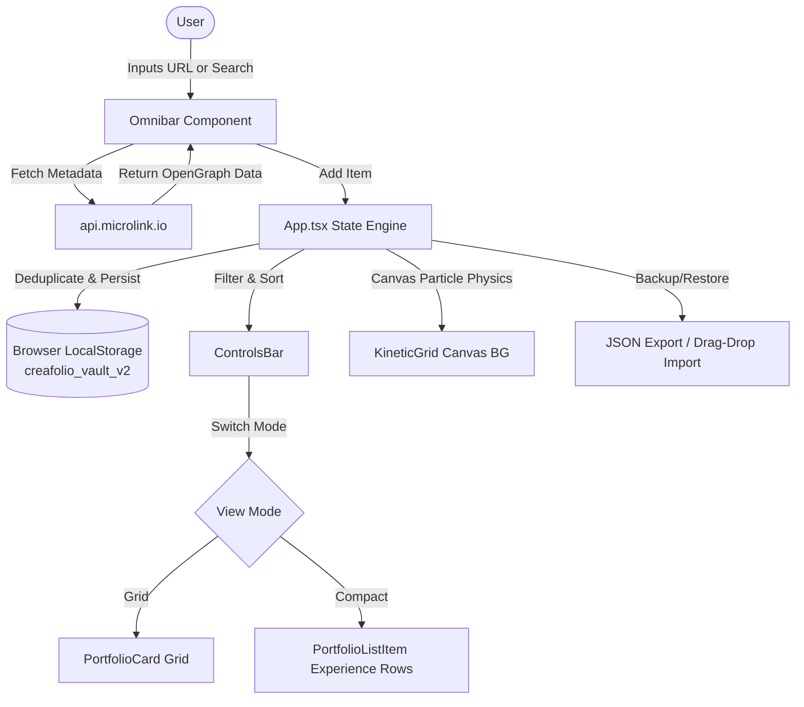

# Creafolio — Project Context & Progress Report

> **Target Audience**: AI Agents & Engineering Collaborators  
> **Repository**: [Creafolio](file:///home/shibam/Documents/GitHub/Creafolio)  
> **Last Verified**: September 29, 2026 (`main` branch @ `1b05218`)  
> **Build Status**: Passing (`tsc && vite build` clean, 0 errors)

---

## 1. Project Overview & Philosophy

**Creafolio** is a client-side personal bookmarking and curation vault for design references, portfolios, and UI engineering resources. It is built to provide a Linear/Vercel-inspired dark-mode-first aesthetic with high-polish interactive canvas visuals.

### Core Principles
1. **Zero-Backend & Local-First**: 100% client-side execution. All data persists strictly in browser `localStorage`. No user accounts, database credentials, or backend server required.
2. **Instant Curation via Metadata Scraping**: Pasting any URL automatically queries public metadata endpoints (Microlink API and Unavatar/Thum.io) to extract title, description, cover image, and favicon.
3. **Fluid Interactive Experience**: Features an interactive kinetic grid canvas background with physics-based mouse reactions, scroll-morphing resizable navbar, and dual layout views (Grid Cards vs. Experience List Rows).
4. **Resilient Data Management**: Built-in JSON import/export, drag-and-drop file upload anywhere onto the viewport, and automated URL/ID deduplication to prevent cache pollution.

---

## 2. Technology Stack & Environment

| Layer | Technology | Details / Version |
| :--- | :--- | :--- |
| **Runtime & Bundler** | [Vite 6](file:///home/shibam/Documents/GitHub/Creafolio/vite.config.ts) | `@vitejs/plugin-react` v4.3.4, ESM modules |
| **Framework** | [React 19](file:///home/shibam/Documents/GitHub/Creafolio/package.json#L18) | React 19.3.0 + React DOM 19.3.0 |
| **Type System** | [TypeScript 5.7](file:///home/shibam/Documents/GitHub/Creafolio/tsconfig.json) | Strict mode enabled, path alias `@/*` -> `src/*` |
| **Styling** | [Tailwind CSS v4](file:///home/shibam/Documents/GitHub/Creafolio/src/index.css) | `@tailwindcss/vite` & `@tailwindcss/postcss` v4.3.3 |
| **Motion & Animation** | [Motion](file:///home/shibam/Documents/GitHub/Creafolio/package.json#L17) | `motion` v13.4.2 (successor to framer-motion) |
| **Icons** | Lucide React & Tabler Icons | `lucide-react` v1.16.0, `@tabler/icons-react` v3.48.0 |
| **Storage Layer** | LocalStorage API | Storage key: `creafolio_vault_v2` (auto-migrated from `creafolio_vault_master`) |



---

## 3. Architecture & File Structure

```
Creafolio/
├── src/
│   ├── App.tsx                     # Main controller, state management, deduplication, search/filter
│   ├── main.tsx                    # React 19 root bootstrap
│   ├── types.ts                    # Core TypeScript definitions (PortfolioItem)
│   ├── index.css                   # Tailwind v4 import directives & custom styling
│   ├── lib/
│   │   └── utils.ts                # Tailwind clsx + twMerge utility (cn helper)
│   └── components/
│       ├── Omnibar.tsx             # Floating URL submission and scraper trigger
│       ├── ControlsBar.tsx         # Category pills, view toggle, search bar
│       ├── PortfolioCard.tsx       # Standard card presentation (cover, tags, actions)
│       ├── PortfolioListItem.tsx   # Experience-style horizontal list view
│       ├── EditModal.tsx           # Portfolio item editing modal
│       ├── BackupModal.tsx         # JSON import/export modal
│       ├── ConfirmModal.tsx        # Reusable alert/danger confirmation dialog
│       ├── Toast.tsx               # Floating feedback alerts
│       ├── BrandLogo.tsx           # Creafolio vector logo component
│       └── ui/
│           ├── kinetic-grid.tsx    # Canvas 2D particle/grid simulation with mouse physics
│           └── resizable-navbar.tsx # Dynamic scroll-morphing floating navigation bar
├── app.js                          # [Legacy] Pre-Vite vanilla JS version (historical reference)
├── style.css                       # [Legacy] Pre-Vite vanilla CSS (historical reference)
├── index.html                      # HTML entrypoint with viewport & meta tags
├── manifest.json                   # Web app manifest for PWA capabilities
├── vite.config.ts                  # Vite config with @ alias and React plugin
└── package.json                    # Project metadata & npm dependencies
```

---

## 4. Key Data Models

From [src/types.ts](file:///home/shibam/Documents/GitHub/Creafolio/src/types.ts):

```typescript
export interface Collection {
  id: string;          // UUID from Supabase or unique ID
  name: string;        // Collection display name (e.g. 'UI & Components')
  slug: string;        // URL/filter slug (e.g. 'ui-components')
  description?: string;// Collection description
  display_order?: number; // Ordering sequence
  created_at?: string;
  updated_at?: string;
  count?: number;      // Computed resource count
}

export interface PortfolioItem {
  id: string;          // Unique ID (e.g. 'seed-1' or generated UUID)
  url: string;         // Normalized destination URL
  title: string;       // Web page title or extracted OpenGraph title
  domain: string;      // Parsed hostname (e.g. 'rauno.me')
  collections: Collection[]; // Many-to-many collections
  collection_ids?: string[]; // Array of collection UUIDs
  description: string; // Summary / OpenGraph description
  image: string;       // Screenshot / OG image (Microlink or thum.io fallback)
  icon: string;        // Favicon URL (unavatar.io or DuckDuckGo icons)
  tags: string[];      // Array of tags (e.g. ['React', '3D / WebGL'])
  pinned: boolean;     // Pin to top flag
  published: boolean;  // Live publication status
  createdAt?: number;  // Timestamp (epoch ms)
  created_at?: string; // ISO 8601 string from Supabase
  updated_at?: string; // ISO 8601 string from Supabase
}
```

---

## 5. Development Progress & Completed Milestones

The repository has been successfully transitioned from an initial vanilla prototype to a modern React 19 + TypeScript production build:

| Commit Hash | Milestone | Highlights |
| :--- | :--- | :--- |
| `cad3669` | Initial commit | Repository creation. |
| `77daa89` | Core setup | Initial design system, manifests, favicon, and vanilla UI layout. |
| `3b0ac37` | Infrastructure setup | Installed React 19, Vite 6, TypeScript 5.7, Tailwind CSS v4, and `@/*` alias structure. |
| `4026010` | UI component foundation | Created `KineticGrid` canvas physics, `ResizableNavbar`, `Omnibar`, and `ControlsBar`. |
| `b75f19f` | Component suite & Modals | Added `PortfolioCard`, `EditModal`, `BackupModal`, `ConfirmModal`, and `Toast`. |
| `1ca3d53` | List view & Cache deduplication | Implemented `PortfolioListItem` experience row view and sanitized `localStorage` deduplication engine in `App.tsx`. |
| `1b05218` | Documentation update | Comprehensive update of `README.md` reflecting React 19 / Vite architecture. |
| `current` | 10 Standard Collections System | Replaced old category/collection names with exactly 10 curated collections; safely remapped legacy categories and deprecated collections (e.g. Tools & Resources -> Developer Tools / AI Tools / Fonts, Icons & Assets) without data loss or duplication; updated Supabase schema & master migration script; updated Admin modal with alignment action. |

### Current State
- **Git Tree**: Clean, working directory verified.
- **Build**: Verified passing (`✓ built in 6.93s`, generating optimized production bundle in `dist/`).
- **Standard Collections (10)**: UI & Components, Landing Pages, Portfolios, Design Systems, Animations & Interactions, 3D & WebGL, AI Tools, Developer Tools, Fonts, Icons & Assets, Inspiration & Experiments.
- **Seed Data**: 8 curated references populated out-of-the-box with multi-collection associations.
- **Search & Filtering Engine**:
  - Comprehensive instant search across title, domain, description, collections, tags, and URLs.
  - Interactive Autocomplete suggestions popover with matching collections, tags, and resources.
  - Multi-select Collections popover + multi-select pills with resource counts.
  - Multi-select searchable Tags popover with occurrence counts.
  - Multi-mode sorting: Default (Featured first), Recently Added, Alphabetical (A-Z), and Featured.
  - Active filter badges strip with one-click dismiss (✕) and "Clear filters" action.
  - Empty state with "Clear Filters" reset.
  - Bidirectional URL state synchronization (`?q=...&collections=...&tags=...&sort=...`) for shareable filtered views.

---

## 6. Important Operational Details for Incoming Agents

> [!NOTE]
> **Data Migration & Deduplication**:
> [src/App.tsx](file:///home/shibam/Documents/GitHub/Creafolio/src/App.tsx) maintains cache integrity and provides client-side filtering and sorting for instant reactivity.

> [!TIP]
> **Metadata Scraping Fallbacks**:
> When a user enters a URL in `Omnibar.tsx`, [fetchMetadata in App.tsx](file:///home/shibam/Documents/GitHub/Creafolio/src/App.tsx) queries `api.microlink.io`. If Microlink is rate-limited or fails, it falls back to `image.thum.io` for screenshots and `unavatar.io` / `duckduckgo` for icons.

> [!IMPORTANT]
> **Legacy Relic Files**:
> The root `app.js` and `style.css` files are leftovers from the pre-Vite implementation. The active application is driven by `src/` and `index.html`.

---

## 8. Smooth Video Previews System

- **Optional Video Enhancement**: Resources can specify `video?: string | null` and `previewType?: 'image' | 'video'`.
- **Safe Fallback**: Every card always keeps its static screenshot (`image`). If a video URL is invalid, fails to play, or errors, the card falls back instantly to the screenshot without visual disruption.
- **Desktop Hover Playback**:
  - `preload="metadata"`, `muted`, `loop`, `playsInline`.
  - Video plays smoothly on card hover and automatically pauses on mouse leave.
  - Cards scrolling out of the viewport are paused via `IntersectionObserver`.
  - Layout stability: `aspect-video` container guarantees card dimensions never jump or shift.
- **Accessibility & Mobile**:
  - Automatically respects `prefers-reduced-motion: reduce`.
  - Touch devices gracefully display the static poster screenshot.
- **Admin Panel Control**:
  - Preview Type toggle (`Image` vs `Video`).
  - Text input for custom direct video/stream URLs.
  - Inline "Test Video" player with status validation.
- **Lightweight Scraper Ingestion**:
  - `fetchMetadata` checks Microlink API's OpenGraph video output (`data.video?.url` or `data.video`) safely without blocking URL ingestion.
- **Database Schema**:
  - Updated `supabase/schema.sql` and created `supabase/migration_video_preview.sql`.

## 9. Recommended Next Steps / Roadmap

Incoming agents can build upon the following areas:

1. **Offline Screenshot Caching / Local Blobs**:
   - Currently, images rely on remote URLs (`thum.io` / `microlink`). An option to upload custom local image covers (stored as data URIs/IndexedDB) would protect against remote broken links.
2. **Test Coverage**:
   - Add Vitest and React Testing Library setup for unit testing helper functions (`deduplicateItems`, `fetchMetadata`) and component rendering.
3. **PWA Service Worker Registration**:
   - `manifest.json` is configured; registering an active service worker in `main.tsx` would make the app fully usable offline.
